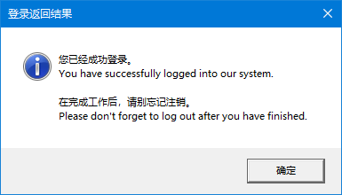
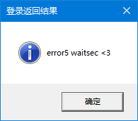
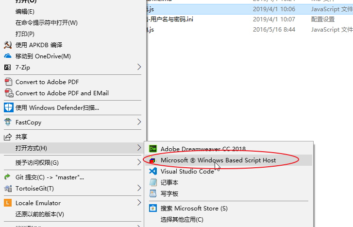

# 三军医大快速联网登陆-JScript版
>JScript是与VBS同属 Windows 脚本宿主 的本地执行脚本语言，遵守ECMAScript规范（大概在ES3），注意不是浏览器用的 JavaScript。

除了在自己电脑上快速联网外，也可以将程序文件复制到U盘里，在其他电脑上也能一键登录。  
程序储存的密码已Hash加密，不会泄露真实密码，所以也方便将账号借予他人使用。

## 下载
在文件页面的“Raw”按钮上右键另存为即可
* 访问 [登陆.js](登陆.js) 文件
* 访问 [注销.js](注销.js) 文件

## 如何登陆
直接双击运行`登陆.js`，登陆成功提示数秒后会自动退出。  

如果你是首次使用，程序还会给出如下提示。

1. 输入用户名与密码；
1. 确认储存用户名与密码的文件；
1. 确认是否设定开机启动。

### 多账号快速登陆
如果还需要快速登陆其他人的账号，复制`登陆.js`并改名（如`张三联网.js`）后执行即可。

## 如何注销
直接运行`注销.js`，注销成功提示数秒后会自动退出。

### 登陆冷却限制
网关系统自2017年6月更新后存在登陆冷却时间。每当主动注销、强制踢下线、重新登陆，都会在短时间内返回登陆失败提示。遇此情形请等待数秒后重新登陆即可。  

## 程序无法正常执行
本程序基于 *Windows Script Host*，少数用户修改了 js 文件的默认执行程序导致无法运行。  
将 js 文件的打开方式修改为`Windows Based Script Host`即可。  
