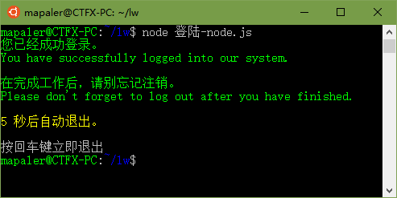

# 三军医大快速联网登陆-Node.js版
为了支持Mac和Linux，写了个Node的版本（我只会js）

Linux的执行  


## 如何安装
1. 保存[登陆-node.js](登陆-node.js)文件  
https://nodejs.org/zh-cn/
1. 安装nodejs  
https://nodejs.org/zh-cn/
1. 在“登陆-node.js”的文件夹下用终端运行这行代码（安装依赖模块）。  
	```shell
	npm install iconv-lite
	```
1. 用nodejs运行代码，正式执行  
	```shell
	node 登陆-node.js
	```

## 如何一键登录
把执行代码写成 shell 或 批处理 即可  
```shell
node 登陆-node.js
```
* Windows可以运行[Windows.bat](Windows.bat)（保证能用）
* Mac可以尝试运行[Mac.command](Mac.command)（我没Mac，没试过）
* Linux我也不懂，自己写一个吧，但是这个命令是能用的。

## 如何注销
暂未开发，自己用网页注销吧